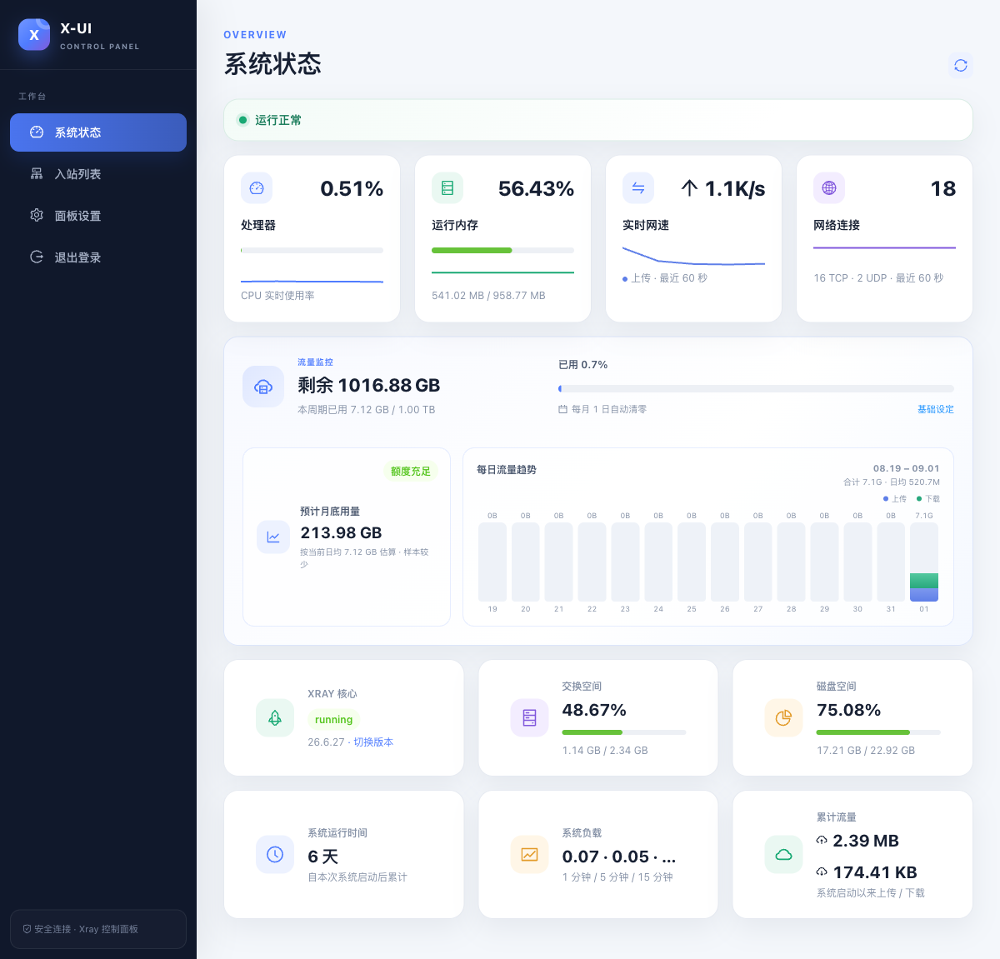
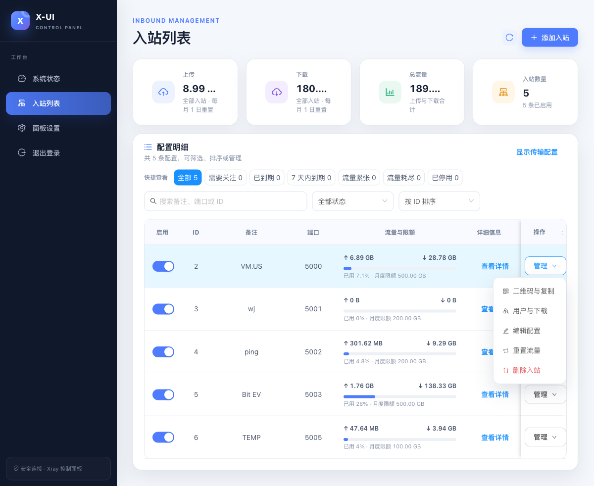
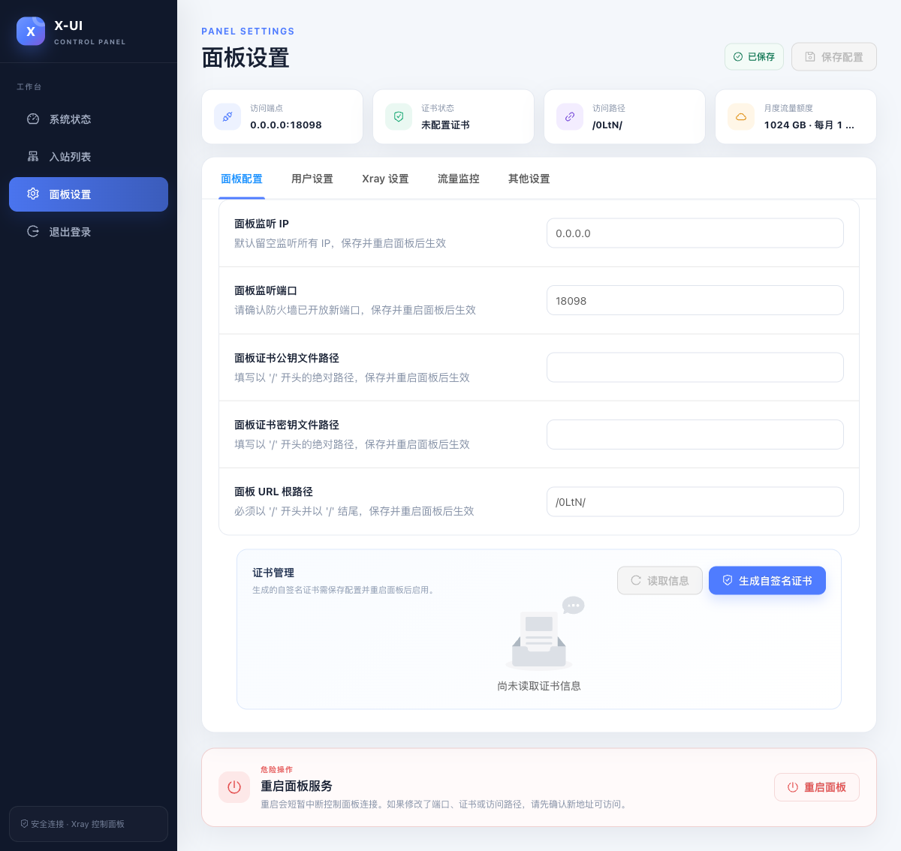

# X-UI · RoyLive 私有维护版

> 此仓库为私有维护版本，暂不对外发布。它基于 [FranzKafkaYu/x-ui](https://github.com/FranzKafkaYu/x-ui) 演进，保留原项目的 GPL-3.0 许可证和署名。

面向日常服务器运维的 Xray 控制面板：优先呈现运行健康、流量和入站状态，并将高频管理操作收敛为更清晰的工作流。

## 本版关键能力

- 简洁的运行健康监控：正常时只显示“运行正常”，异常时才展开具体监测项。
- 服务器流量监控：月度额度、每月 1–31 日重置、近 14 天趋势和月底用量预测。
- 资源状态重新排序：实时网速与网络连接置于前列，并提供最近 60 秒实时曲线。
- VLESS 专注的入站管理：按月自动重置入站流量，隐藏非必要传输信息，日期仅显示到天。
- 用户与配置分发：可为入站新增独立用户，直接下载 Clash Verge 配置；管理菜单可生成二维码或复制配置。
- 面板设置增强：流量配置可靠保存、可选择时区、显示证书关键信息并生成自签名证书。

## 界面预览

| 系统状态 | 入站管理 | 面板设置 |
| --- | --- | --- |
|  |  |  |

截图来自隔离预览环境，未使用线上访问地址或管理凭据。

## 使用与维护说明

- 本私有版本的网页管理界面仅支持 VLESS；已有非 VLESS 入站不会在此管理流程中创建或编辑。
- 为避免影响既有节点，Reality 等现有传输配置在用户管理流程中保持原样；无需要时不建议修改。
- 上游仓库的“一键安装/更新”脚本会拉取上游版本，**不适用于部署或更新本私有维护版**。本版本请从本仓库构建并按内部发布流程部署。
- 完整变更见 [CHANGELOG.md](./CHANGELOG.md)。
